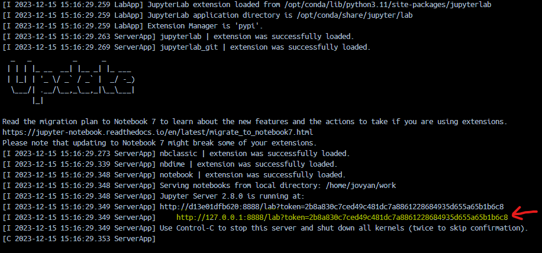

# EXTRAÇÃO E ORGANIZAÇÃO DE DADOS WEB

**Descrição**:

O desafio é desenvolver um programa em Python capaz de acessar e extrair informações de um website específico, organizando-as de forma eficaz.

*! Importante ressaltar que o uso do Selenium* ou bibliotecas similares** não é permitido.

**Critérios de Avaliação:**

 Organização dos Dados: A maneira como os dados são estruturados e armazenados para fácil acesso e manipulação.
 Lógica de Programação: A clareza, eficiência e eficácia da lógica empregada para acessar, extrair e organizar os dados.
 Leitura de Arquivos: A habilidade em lidar com a leitura dos arquivos disponibilizados no website, bem como a interpretação correta dos dados contidos neles.
 Download de Arquivos: A implementação de uma solução robusta para o download dos arquivos disponíveis, garantindo a integridade dos dados.

* *Website Alvo:*
  url = site_alvo.com.br
* *Códigos de Acesso:*
  codigo = 123456

Após a inserção dos códigos, o candidato obterá acesso aos arquivos relevantes que deverão ser processados.
Publicação: O código finalizado deve ser publicado em um repositório GitHub, com um README explicativo.

**Observações:**

* Selenium é uma ferramenta que permite controlar um navegador web pelo computador. Funciona em diferentes navegadores e sistemas operacionais, e pode ser usado com várias linguagens de programação, como Python. Geralmente é usado para testar aplicativos web automaticamente, mas também ajuda a coletar dados de sites quando não há APIs disponíveis.
* Qualquer biblioteca que permita o controle do navegador do usuário.

---

## Da pesquisa

### Sobre características e classificação do Selenium em relacao a outras ferramentas de Web Scraping.

Conforme a breve descrição acima, o Selenium tem como origem a automação de testes de aplicativos web, mas também pode ser utilizado para extração de dados de sites quando não há APIs disponíveis.

Devido à restrição de não utilização da biblioteca Selenium e outras semelhantes, como PyAutoGUI e Playwright, para automação de tarefas em navegadores web e sistemas operacionais, surgiu a dúvida se outras bibliotecas e ferramentas (BeautifulSoup, lxml e Scrapy) focadas em scraping se enquadrariam como quebra de requisito.

Sendo assim, aproveitei a oportunidade para realizar uma análise comparativa entre BeautifulSoup e Scrapy para web scraping. Um exemplo de sintaxe e desempenho encontra-se em `./PoC_Scripts_Jupyter/src/` <<< [Veja mais](./PoC_Scripts_Jupyter/) >>> .

### Pré-requisitos

- Git
- Docker
- Docker-Compose

* imagen final com tamanho de 876.19 MB baseada na [Jupyter Docker Stacks](https://github.com/jupyter/docker-stacks)
* 
---
## EXTRAÇÃO E ORGANIZAÇÃO DE DADOS ALVO WEB

### 1 - PoC Web Scraping - 

#### Execução - via Container Docker

```
$ git clone .https://github.com/edcastanha/scraping_api
# >>> Cloning into 'desafio-web-scraping'...
$ cd desafio-web-scraping/Poc_Scripts_Jupyter/
$ docker-compose up
```

Acessando o Jupyter Notebook >>> http://127.0.0.1:8888/lab?token=9675434...



Abra pasta `src/` e execute o scrypt `resolucao_desafio.ipynb` (preencha  url e codigo com informacoes validas)


### 1 - PoC Web Scraping - EXTRAÇÃO E ORGANIZAÇÃO DE DADOS WEB

#### Execução - via Container Docker
```
git clone .https://github.com/edcastanha/scraping_api
cd desafio-web-scraping/Poc_Api_Rest_Docker/
docker-compose up -d
docker exec -it django-server sh entrypoint.sh
docker-compose up -d 
```

### Arquitetura Geral:

1. **Servidor Django:**
   * Será responsável pela definição dos modelos de dados do cliente, URLs e configurações relacionadas.
2. **RabbitMQ Server:**
   * Broker de mensagens para orquestrar as filas.
3. **ConSumer Jobs-Server:**
   * Script responsavel pelo processamento das tarefas cadastradas no sistema e  enfileirados no Broker. 

Aqui está uma descrição detalhada de cada componente:

1. Servidor Django:

* **Modelos de Dados:**
  * Criará modelos de dados para CODIGO, URL e configurações de tarefas.
  * Exemplo:
    * Modelo Alvo: URL, CODIGO, Descrição, etc.
    * Modelo Tarefa: Tipo (diária, semanal, quinzenal, mensal), Parâmetros, Cliente Associado, Alvo Associada, etc.

2. Jobs-Server:

* **Consumer:**
  * Escuta fila 'scrapping' no RabbitMQ
* **Validação de Dados:**
  * Validará os dados recebidos antes de armazená-los no servidor Django;
  * Processa url e codigo via POST para aquisição de response contendo dados de files
  * Executa processamento para armazenar arquivos nos volumes configurados e compartilhados no serviço Django

##### Essa e uma de muitas possiveis aboradagem para arquitetar uma solucao.

Em Volumes/logs podemos acompanhar os processos via ferrametas de observabilidade capiturando ERROR  etc.


***`<center>`! LEMBRETE ! `</center>`***

 **execute para remover os volumes e imagens do docker:**

```
docker-compose down -v --rmi all
```

---

## Conclusão

Considerando o entendimento em relação à interpretação das descrições das ferramentas BeautifulSoup e Scrapy, e devido à não identificação de quebra de requisito em relação ao uso do Selenium e similares, optei por não arriscar a utilização da biblioteca BeautifulSoup para a análise e desenvolvimento da PoC.

Além disso, durante a análise para a realização do web scraping no contexto do desafio, identifiquei que este envolve a extração de dados de páginas que utilizam Single Page Application (SPA). Nessas circunstâncias, observei que a URL apresenta comportamentos distintos ao ser acessada via métodos GET e POST. Esta peculiaridade aumenta a complexidade do scraping e sugere a necessidade de uma abordagem específica para lidar com essas diferenças de comportamento, o que pode impactar a escolha da ferramenta mais adequada para o projeto. No entanto, ao notar essa característica, percebi que facilitou a elaboração da lógica e escolha da infraestrutura para a PoC_API e fluxos dos dados.
